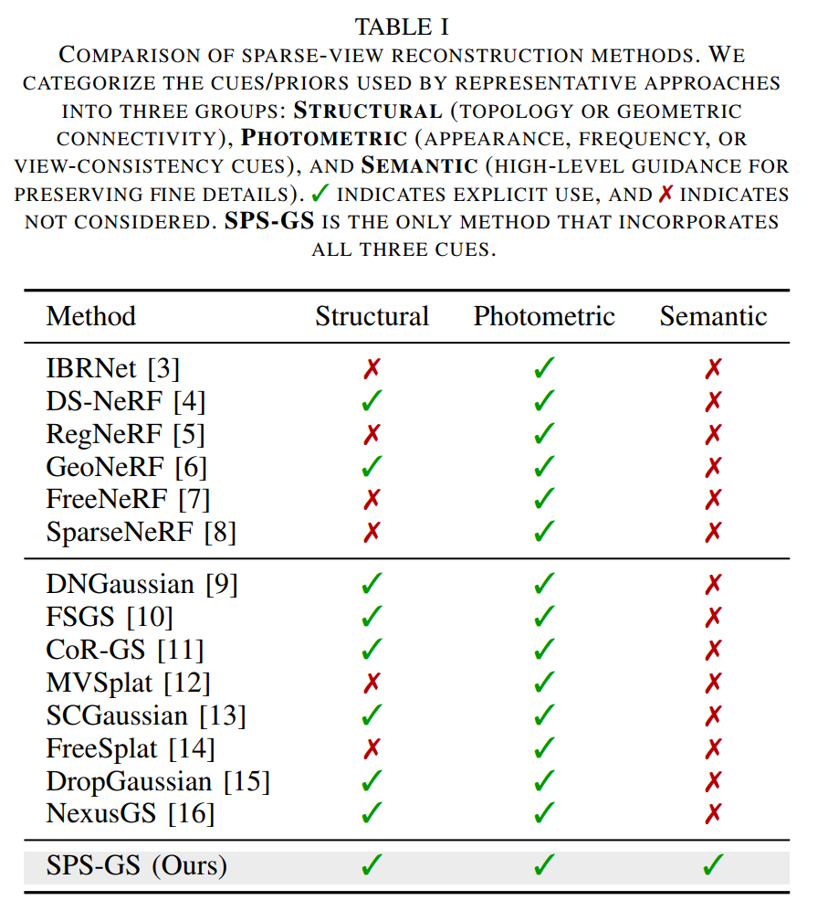
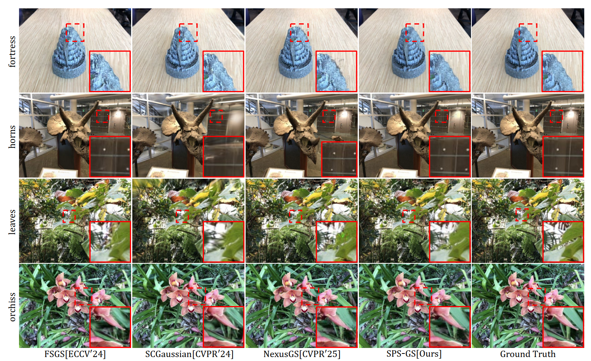
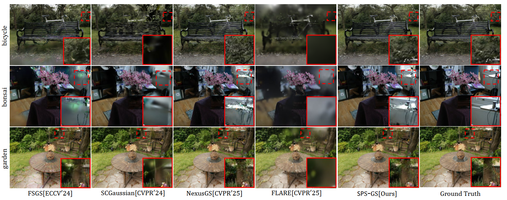
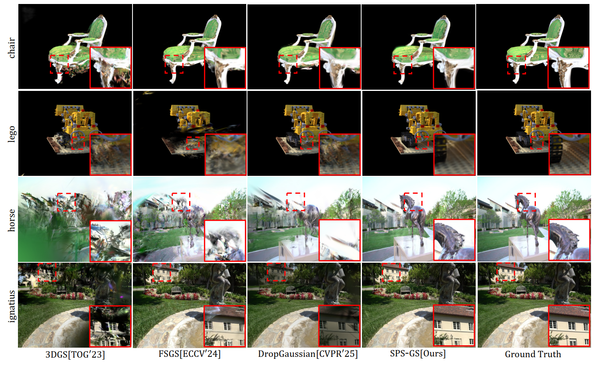

<div align="center">

<h1>Unlocking Structural, Photometric, and Semantic Cues for Sparse-View 3D Gaussian Splatting</h1>

<div>

</div>

<div>

</div>

<div>
    
</div>


</div>


## Overview

Sparse-view 3D Gaussian Splatting often suffers from structural degradation, floating primitives, fragmented geometry, and unreliable appearance estimation under limited supervision. SPS-GS addresses this problem by jointly modeling **structural**, **photometric**, and **semantic** cues within a unified optimization framework.

Specifically, SPS-GS is built on three complementary components:

- **Structural cue**: a topology-aware graph regularizer that removes spurious Gaussians and improves connectivity, producing a more coherent structural scaffold.
- **Photometric cue**: a GNN-based propagation module that transfers reliable appearance information to weakly observed regions, improving texture consistency under sparse views.
- **Semantic cue**: a rarity- and boundary-aware modulation strategy that places more emphasis on informative boundaries and underrepresented structures, helping preserve thin structures and fine details.

By combining these three cues, SPS-GS improves both geometric stability and rendering quality for sparse-view novel view synthesis.

## Related Work Comparison

<div align="center">
  
</div>

<p align="center">
  Comparison of representative sparse-view reconstruction methods with respect to structural, photometric, and semantic cues.
</p>

## Qualitative Results

<div align="center">
  <h3>LLFF (3 Views)</h3>
  
</div>

<p align="center">
  Qualitative comparison on LLFF with three input views.
</p>

<div align="center">
  <h3>mip-NeRF 360 (24 Views)</h3>
  
</div>

<p align="center">
  Qualitative comparison on mip-NeRF 360 with twenty-four input views.
</p>

<div align="center">
  <h3>Blender (8 Views) and Tanks and Temples (3 Views)</h3>
  
</div>

<p align="center">
  Qualitative comparison on Blender with eight input views and Tanks and Temples with three input views.
</p>

## Environmental Setups

Tested on Ubuntu, CUDA 11.8, and Python 3.10.

```bash
conda create -n SPSgs python=3.10
conda activate SPSgs
```

Install PyTorch and the Python dependencies:

```bash
pip install -r requirements.txt --extra-index-url https://download.pytorch.org/whl/cu118
```

Fetch the third-party repositories on demand:

```bash
bash script/fetch_third_party.sh
```

Then install the CUDA extensions:

```bash
pip install submodules/diff-gaussian-rasterization
pip install submodules/simple-knn
```

## Running

We directly provide the dense initialization point clouds used by the method. No additional initialization-point generation step is required before training.

Taking LLFF as an example, the expected dataset layout is:

```text
├── data
    ├── nerf_llff_data_colmap
        ├── fern
            ├── sparse
            │   └── 0
            └── images
├── keypoints_to_3d
    ├── LLFF
        └── fern_keypoints_to_3d.ply
```

### LLFF

Download the [LLFF](https://drive.google.com/drive/folders/1cK3UDIJqKAAm7zyrxRYVFJ0BRMgrwhh4) dataset and place each scene under:

```text
./data/nerf_llff_data_colmap/
```

The provided dense initialization point clouds are already included under:

```text
./keypoints_to_3d/LLFF/
```

Run using the following commands:

```bash
CUDA_VISIBLE_DEVICES=0 python train.py \
    -s ./data/nerf_llff_data_colmap/fern \
    -m ./output/LLFF/fern/3 \
    --n_views 3 \
    --dataset_name LLFF \
    --resolution 2 \
    --eval

CUDA_VISIBLE_DEVICES=0 python render.py \
    --model_path ./output/LLFF/fern/3 \
    --n_views 3 \
    --skip_train \
    --resolution 2 \
    --eval \
    --dataset_name LLFF

CUDA_VISIBLE_DEVICES=0 python metrics.py \
    -m ./output/LLFF/fern/3
```
## Acknowledgements

Our code follows several awesome repositories. We appreciate them for making their codes available to public.
[3DGS](https://github.com/graphdeco-inria/gaussian-splatting) 
[FSGS](https://github.com/VITA-Group/FSGS)
[DNGaussian](https://github.com/Fictionarry/DNGaussian)
[SCGaussian](https://github.com/prstrive/SCGaussian)
[Dropgaussian](https://github.com/DCVL-3D/DropGaussian_release)
[NexusGS](https://github.com/USMizuki/NexusGS/)
